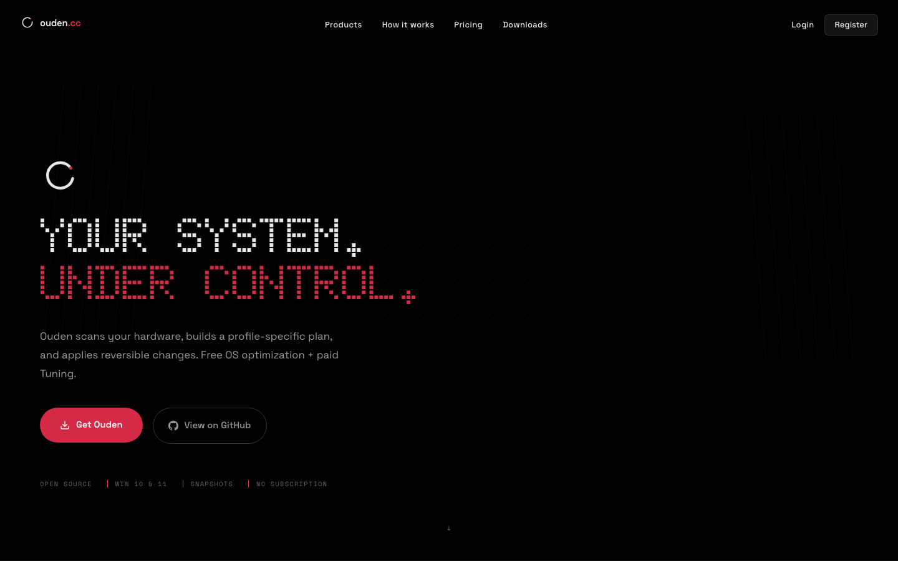
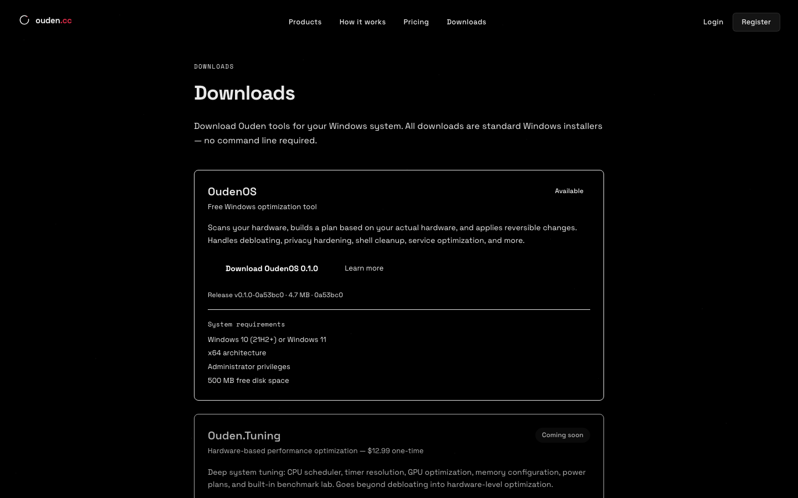

<p align="center">
  
</p>

<h1 align="center">Ouden</h1>

<p align="center">
  Windows optimization that scans first, then acts.<br/>
  Free OS cleanup. One-time Tuning. No subscription.
</p>

<p align="center">
  <a href="https://ouden.cc">Website</a> &nbsp;&middot;&nbsp;
  <a href="https://ouden.cc/downloads">Download</a> &nbsp;&middot;&nbsp;
  <a href="https://github.com/redpersongpt/redcoreOS/releases/latest">Releases</a>
</p>

---



## What is Ouden?

Ouden scans your hardware, builds a profile-specific optimization plan, and applies reversible changes to Windows. No blind scripts. No broken installs. Every action creates a snapshot, every change is undoable.

### OudenOS &mdash; Free

In-place Windows optimization wizard. Debloating, privacy hardening, service cleanup, startup optimization, shell cleanup &mdash; 250+ reversible actions across 8 machine profiles.

- No reinstall needed
- Work PC preservation (Print Spooler, RDP, SMB, Group Policy, VPN protected)
- Full rollback support

### Ouden.Tuning &mdash; $12.99 one-time

Deep hardware-level tuning on top of OudenOS. CPU scheduler, timer resolution, GPU latency, memory configuration, power plans, fan curves, and a built-in benchmark lab for before/after validation.

- 15+ tuning modules
- BIOS guidance layer
- Benchmark lab with before/after comparison
- Lifetime license per machine

## Downloads



**[Download OudenOS](https://ouden.cc/downloads)** &mdash; Free, Windows 10/11 x64

## Stack

```
apps/
  web/               Next.js 16 - ouden.cc
  tuning-desktop/    Electron - Ouden.Tuning
  os-desktop/        Tauri - OudenOS wizard
  cloud-api/         SaaS backend (auth, billing, licensing)
  tuning-api/        Tuning product API
  os-api/            OS product API

packages/
  db/                     Shared PostgreSQL schema (Drizzle)
  tuning-design-system/   Design tokens + Tailwind preset
  system-analyzer/        Hardware classification engine

services/
  tuning-service/    Rust privileged daemon
  os-service/        Rust transformation engine

playbooks/           40 YAML transformation modules
```

## Dev

```bash
pnpm install
pnpm dev:web        # ouden.cc
pnpm dev:tuning     # Ouden.Tuning desktop
pnpm dev:os         # OudenOS desktop
```

## Architecture

- **Monorepo** &mdash; pnpm workspaces, single lockfile
- **IPC** &mdash; Renderer > contextBridge > Electron/Tauri > JSON-RPC > Rust service
- **Playbook-native** &mdash; YAML playbooks > Rust resolver > action executor
- **cloud-api** &mdash; Auth, Stripe billing, licensing, telemetry
- **OudenOS = free** &mdash; No account required, donation-supported
- **Ouden.Tuning = one-time $12.99** &mdash; Lifetime license per machine

## License

Proprietary. See individual product terms at [ouden.cc/terms](https://ouden.cc/terms).
