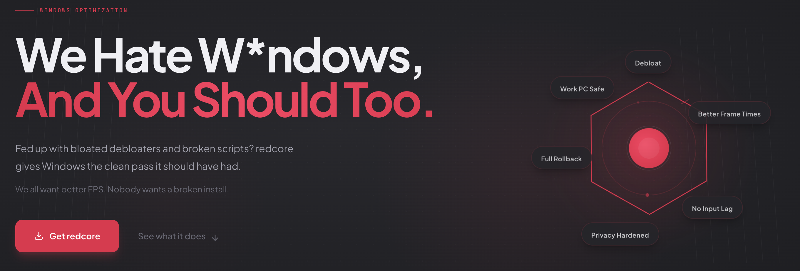
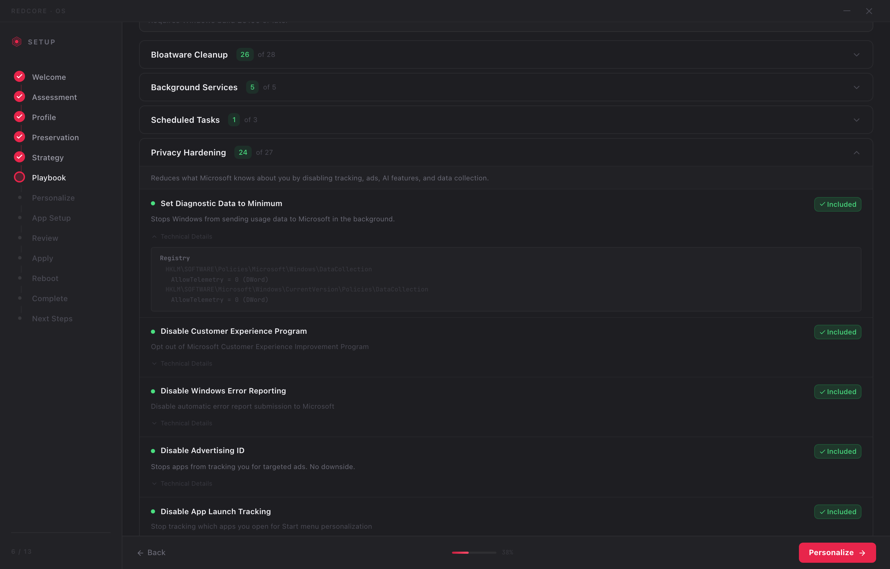
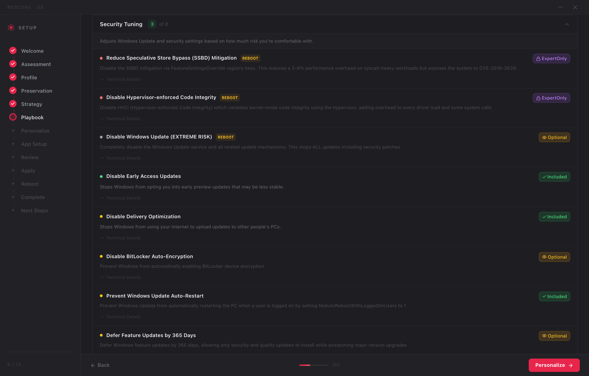
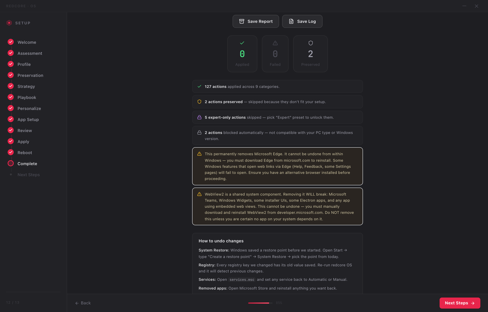

# redcore OS

<p align="center">
  <a href="https://redcoreos.net" target="_blank">
    
  </a>
</p>

<div align="center" style="display:flex;flex-wrap:wrap;gap:0.35rem;justify-content:center;">
  <a href="https://redcoreos.net" target="_blank">
    
  </a>
  <a href="https://github.com/redpersongpt/redcoreOS/stargazers" target="_blank">
    
  </a>
  <a href="LICENSE">
    
  </a>
  <a href="https://redcoreos.net" target="_blank">
    
  </a>
</div>

<p align="center" style="margin-top:1.2rem;">
  <a href="https://redcoreos.net/download" target="_blank" style="display:inline-flex;align-items:center;gap:0.5rem;background:#ff3b6d;color:#fff;font-weight:600;padding:0.85rem 1.6rem;border-radius:999px;box-shadow:0 15px 35px rgba(255,59,109,0.35);text-decoration:none;">
    <span>Download redcore OS</span>
  </a>
</p>

Windows debloat tools love to overpromise and break things. redcore OS does the opposite: it scans your machine, classifies your hardware, shows you exactly what it plans to change, and only then applies reversible tweaks through a local Rust service. Nothing runs without your review. Everything can be rolled back.

## How It Works

1. **Scan** &mdash; the app detects your hardware, installed software, and current configuration.
2. **Classify** &mdash; your machine is matched to a profile (Gaming Desktop, Office Laptop, Work PC, etc.).
3. **Review** &mdash; you see every single action the tool will take, with risk levels and explanations. Nothing is hidden.
4. **Execute** &mdash; changes run through a local privileged Rust service. The renderer never touches the system directly.
5. **Rollback** &mdash; every change is logged with its original value. You can undo any action, any time.

## What It Does NOT Do

Let's be upfront, because this is where most tools lose trust:

| Concern | redcore OS behavior |
|---------|-------------------|
| **Windows Defender** | Kept enabled by default. Disabling is expert-only, opt-in, and blocked on Work/Office profiles. |
| **Windows Update** | Not disabled by default. Update control is available but requires explicit confirmation. |
| **Security mitigations** | Spectre/Meltdown mitigations are untouched unless you manually opt in as an expert. |
| **Anti-cheat** | Vanguard, EAC, and BattlEye are not affected by default. VBS disable (which can break Vanguard) is expert-only and shows a warning. |
| **One-click nuke** | Does not exist. Every action requires review. There is no "apply all" button. |

## What It Actually Changes

Every tweak is defined in a human-readable YAML playbook. You can read every single one before running the app.

<p align="center">
  
  <br />
  <em>Every action shows its exact registry keys, risk level, and status before you run anything.</em>
</p>

<details>
<summary><strong>Bloatware Cleanup</strong></summary>

Removes pre-installed consumer apps (Candy Crush, TikTok, Instagram, etc.), optional Microsoft apps, and third-party OEM bloatware. Edge removal and Copilot removal are separate opt-in actions.

See: [`playbooks/appx/`](playbooks/appx/)
</details>

<details>
<summary><strong>Background Services</strong></summary>

Disables telemetry services (DiagTrack, dmwappushservice), consumer services (Xbox, Maps, Wallet), and optionally Windows Update services. Each service change lists the exact service name and what it does.

See: [`playbooks/services/`](playbooks/services/)
</details>

<details>
<summary><strong>Scheduled Tasks</strong></summary>

Disables telemetry and consumer scheduled tasks (Customer Experience, Application Experience, Cloud Experience Host, etc.).

See: [`playbooks/tasks/`](playbooks/tasks/)
</details>

<details>
<summary><strong>Privacy</strong></summary>

Disables advertising ID, activity history, input personalization, diagnostic data, and AI features (Recall, Copilot telemetry). Registry keys are listed in each playbook.

See: [`playbooks/privacy/`](playbooks/privacy/)
</details>

<details>
<summary><strong>Performance</strong></summary>

CPU scheduler priority, memory management (Large System Cache, IO page lock limit), GPU optimizations (hardware-accelerated scheduling, NVIDIA P-State), timer resolution, power plan, storage (disable last access timestamps, prefetch tuning). No magic numbers, no "500% FPS boost" claims.

See: [`playbooks/performance/`](playbooks/performance/)
</details>

<details>
<summary><strong>Shell & Explorer</strong></summary>

Taskbar cleanup (remove widgets, news, Copilot button), context menu restore (Windows 11 classic menu), disable search highlights, remove ads/tips from Settings and Start.

See: [`playbooks/shell/`](playbooks/shell/)
</details>

<details>
<summary><strong>Network</strong></summary>

Disable legacy protocols (NetBIOS, LLMNR, LMHOSTS), Nagle's algorithm tuning, network throttling index. Security hardening, not aggressive ripping.

See: [`playbooks/networking/`](playbooks/networking/)
</details>

<details>
<summary><strong>Security (Expert-Only)</strong></summary>

VBS, HVCI, Spectre/Meltdown mitigations, Defender control. All default to OFF. All require expert opt-in. All show risk warnings. All are blocked on Work PC and Office Laptop profiles.

See: [`playbooks/security/`](playbooks/security/)
</details>

<p align="center">
  
  <br />
  <em>Dangerous actions are labeled Expert-only, show REBOOT badges, and are never enabled by default.</em>
</p>

### What a playbook action looks like

Every action in redcore OS is a YAML block like this. This is a real action from [`playbooks/privacy/telemetry.yaml`](playbooks/privacy/telemetry.yaml):

```yaml
- id: privacy.disable-telemetry
  name: "Set Diagnostic Data to Minimum"
  description: "Set Windows diagnostic data collection to Security level (minimum)"
  rationale: "Prevents Windows from collecting usage, browsing, and app telemetry"
  risk: safe
  default: true
  reversible: true
  requiresReboot: false
  blockedProfiles: []
  registryChanges:
    - hive: HKLM
      path: "SOFTWARE\\Policies\\Microsoft\\Windows\\DataCollection"
      valueName: AllowTelemetry
      value: 0
      valueType: DWord
    - hive: HKLM
      path: "SOFTWARE\\Microsoft\\Windows\\CurrentVersion\\Policies\\DataCollection"
      valueName: AllowTelemetry
      value: 0
      valueType: DWord
```

Every action follows this structure. `risk` tells you the severity. `reversible` tells you if it can be undone. `registryChanges` shows the exact keys. `blockedProfiles` shows which machine types skip this action. There are no hidden operations beyond what the YAML declares.

## Anti-Cheat Compatibility

If you play competitive games, this matters:

| Anti-Cheat | Default behavior | Risk area | What to watch |
|-----------|-----------------|-----------|--------------|
| **Vanguard** (Valorant) | Not affected | VBS/HVCI disable | Vanguard requires VBS on Windows 11. If you manually opt in to disable VBS (expert-only, `risk: high`), Vanguard will refuse to launch. The app warns you before this action. |
| **Easy Anti-Cheat** (Fortnite, Apex, Rust) | Not affected | None by default | EAC does not depend on VBS, HVCI, or any service that redcore OS touches by default. |
| **BattlEye** (PUBG, DayZ, R6 Siege) | Not affected | None by default | BattlEye does not depend on any default redcore OS action. |
| **Kernel anti-cheat in general** | Not affected | Vulnerable Driver Blocklist | Disabling the Vulnerable Driver Blocklist (`risk: high`, expert-only, premium) may interact with kernel-level anti-cheat. This action is off by default and blocked on most profiles. |

If you only use default settings, no anti-cheat is affected. Risk exists only in expert-only actions that you must manually enable with full warnings shown.

## Machine Profiles

The app classifies your machine and applies a matching profile. Profiles control which actions are available and which are blocked:

| Profile | Preset | Notes |
|---------|--------|-------|
| Gaming Desktop | Aggressive | All tweaks available, expert actions still require opt-in |
| Gaming Laptop | Balanced | Power management preserved, thermal limits respected |
| Budget Desktop | Aggressive | Maximum cleanup for low-resource systems |
| High-end Workstation | Balanced | Professional software compatibility preserved |
| Office Laptop | Balanced | Print spooler, OneDrive, managed updates kept |
| Work PC | Conservative | Domain services, GPO, RDP, enterprise networking preserved |
| Low-Spec System | Aggressive | Maximum resource recovery |
| Virtual Machine | Conservative | Hypervisor features preserved |

## Architecture

```
apps/os-desktop/       Tauri + React desktop shell
services/os-service/   Rust privileged service (registry, services, tasks, rollback)
playbooks/             YAML action definitions and machine profiles
```

- The desktop app is the UI. It never executes system changes directly.
- The Rust service is the only component with elevated privileges. It validates actions, applies changes, and stores rollback data.
- Playbooks are declarative YAML. No compiled black-box logic. You can audit every registry key, every service change, every scheduled task disable.

## Build From Source

### Desktop

```bash
pnpm install
pnpm --dir apps/os-desktop build
```

### Rust Service

```bash
cargo build --release --manifest-path services/os-service/Cargo.toml
```

### Windows Installer

```bash
cargo tauri build --config apps/os-desktop/src-tauri/tauri.conf.production.json
```

The installer build expects the Rust service binary to be built first. Requires [Tauri CLI](https://v2.tauri.app/start/create-project/#prerequisites).

## How to Audit Before Running

You do not need to trust this README. You can verify everything yourself:

1. **Read the playbooks.** Open [`playbooks/`](playbooks/) &mdash; every action is a YAML file. No compiled logic, no obfuscation. Each file lists the exact registry keys, services, packages, and scheduled tasks that will be modified.

2. **Check risk levels.** Every action has a `risk` field: `safe`, `low`, `medium`, `high`, or `extreme`. Search for `risk: high` or `risk: extreme` to find the aggressive actions &mdash; they are all `default: false` and `expertOnly: true`.

3. **Check what your profile blocks.** Open [`playbooks/profiles/`](playbooks/profiles/) to see which actions are blocked for your machine type. Work PCs block security tweaks, update disables, and network changes by default.

4. **Inspect in-app before executing.** The review step shows every action with expandable technical details: exact registry paths, service names, risk level, and whether the action is reversible. Nothing executes until you advance past this screen.

5. **Search for any registry key.** If you want to know whether a specific key is touched, search the `playbooks/` directory. If it is not in a YAML file, redcore OS does not touch it.

## FAQ

**Is this another "custom Windows ISO" project?**
No. redcore OS does not ship a modified Windows image. It runs on your existing Windows 10/11 installation and applies registry, service, and task changes. Your Windows license, activation, and update channel are untouched.

**Will this break my games?**
Default settings do not touch anti-cheat dependencies. VBS (required by Vanguard) is only disabled if you manually opt in and acknowledge the warning. EAC and BattlEye are unaffected by any default action.

**Can I undo everything?**
Yes. The Rust service logs every change with its original value. You can roll back individual actions or the entire session.

<p align="center">
  
  <br />
  <em>After execution: applied/preserved counts, rollback instructions, and exportable report.</em>
</p>

**Why Rust for the service?**
System-level operations need memory safety and predictable performance. Rust gives both without a runtime. The service handles registry writes, service state changes, file operations, and rollback &mdash; all operations where a crash or corruption would be catastrophic.

**Why are playbooks YAML and not compiled?**
So you can read them. Every action, every registry key, every risk level is visible in plain text before you run anything. No trust-me binaries.

**Windows SmartScreen warns me when I run the installer. Is this safe?**
Yes. SmartScreen flags executables that are new or not signed with an Extended Validation certificate. This is normal for independent open-source software. The warning disappears as the app builds download reputation over time. To verify the download yourself: check the SHA-256 hash published with each release, review the source code in this repo, and read the playbooks to confirm what the app actually does. If you are uncomfortable running unsigned software, you can build from source instead.

## Verifying a Release

Each release includes:

- **SHA-256 hash** published in the release notes. Compare with `certutil -hashfile redcore-os-setup.exe SHA256` on Windows or `shasum -a 256` on macOS/Linux.
- **VirusTotal scan** linked in the release notes so you can verify the binary independently.
- **Source tag** matching the release, so you can build from source and compare.

If a release does not include these, do not install it. File an issue instead.

## Security

If you find a security issue, use [SECURITY.md](SECURITY.md) instead of opening a public issue.

## License

GPL-3.0. See [LICENSE](LICENSE).

---

**[https://redcoreos.net](https://redcoreos.net)** · **[redpersongpt/redcoreOS](https://github.com/redpersongpt/redcoreOS)**

[](https://star-history.com/#redpersongpt/redcoreOS&Date)
