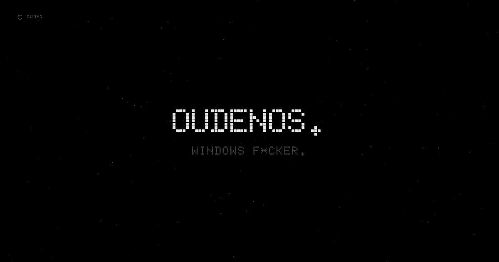
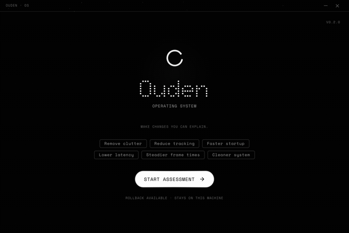

<p align="center">
  
</p>

<p align="center">
  <a href="https://ouden.cc"></a>
  <a href="https://github.com/redpersongpt/oudenOS/releases/latest"></a>
  <a href="LICENSE"></a>
</p>

---

## What this is

A 5MB tool that does what you'd spend 4 hours doing manually in regedit — except it won't brick your install because it actually knows what your hardware is before changing anything.

Scans your machine. Classifies it. Shows you the full list. You pick what stays and what goes. Restore point before every change. Done.

No account. No internet required. No background process. Closes when you close it.

## What it actually changes

<details>
<summary><b>Privacy</b> — Windows ships with 70+ telemetry endpoints enabled by default</summary>

- Disables DiagTrack, dmwappushservice, Connected User Experiences
- Removes Copilot, Recall, activity history, clipboard cloud sync
- Blocks ~70 known telemetry hostnames via hosts file
- Disables advertising ID, location tracking, speech data collection
- Removes Start menu "suggestions" (they're ads)

Registry keys under `HKLM\SOFTWARE\Policies\Microsoft\Windows\DataCollection`. [See the playbooks.](playbooks/privacy)
</details>

<details>
<summary><b>Performance</b> — the stuff that actually matters</summary>

- Timer resolution → 0.5ms (your system runs at 15.6ms by default)
- Core parking disabled — Windows parks cores for "power savings" on desktops plugged into a wall
- MMCSS configured for multimedia/gaming thread priority
- NDU memory leak fixed — a known Windows bug Microsoft hasn't patched since 2018

`HKLM\SYSTEM\CurrentControlSet`. Standard registry edits.
</details>

<details>
<summary><b>Gaming</b> — Game Bar is recording your screen right now</summary>

- Game DVR/Game Bar background recording → off (yes, it's on by default, yes it uses GPU resources)
- Legacy flip model for DirectX
- GPU telemetry blocked
- HAGS control — depends on your GPU

None of this is controversial. The difference is this tool checks your hardware first instead of blindly applying everything.
</details>

<details>
<summary><b>Services</b> — Windows runs 280+ services. You need about 60.</summary>

Disables things like:
- `DiagTrack` — telemetry collector
- `dmwappushservice` — WAP push routing
- `WSearch` — indexer that thrashes your disk for Cortana
- `MapsBroker` — offline maps for your desktop
- `RetailDemo` — turns your PC into a Best Buy display

Work PC profiles keep Print Spooler, RDP, SMB, Group Policy, VPN running. Task Manager, Explorer, and critical system services are protected — they can never be disabled.
</details>

<details>
<summary><b>Shell</b> — the visual garbage</summary>

- Start menu ads → gone
- Widgets panel → hidden
- Taskbar: Chat, News, Search highlights → removed
- Optional: dark mode, accent color, wallpaper
</details>

<details>
<summary><b>Network</b> — Nagle's algorithm is still enabled by default</summary>

- Nagle disabled — buffers packets "for efficiency." Great for 1984. Bad for gaming in 2026
- QoS adjusted
- TCP/UDP offloading control
- Network throttling index disabled
</details>

<details>
<summary><b>Security</b> — expert only, locked by default</summary>

- VBS/HVCI control (costs 5-15% CPU on some systems)
- Defender management (Tamper Protection detected → skips cleanly)
- CPU mitigations toggle (Spectre/Meltdown patches — 2-8% performance cost)

Behind an expert gate for a reason.
</details>

## What it does NOT do

- Modify system files or DLLs
- Break Explorer or Task Manager (ever)
- Install drivers
- Touch your documents, apps, or games
- Require internet
- Collect any data whatsoever
- Run in the background
- Ask you to create an account

## How it works

<p align="center">
  
</p>

```
SCAN      → reads your hardware, services, startup items
CLASSIFY  → gaming PC, work laptop, VM, etc.
PLAN      → builds an action list for YOUR machine
EXECUTE   → applies changes one by one, restore point first
VALIDATE  → confirms what changed, generates a report
```

Built with Tauri (Rust backend, React frontend). 5MB installer. The privileged Rust service does the actual system modifications — the UI is just a wizard.

## 8 Profiles

| Profile | Protects | Aggression |
|---------|----------|------------|
| Gaming Desktop | GPU services, DirectX | Full cleanup |
| Work PC | Print, RDP, SMB, VPN, Group Policy | Conservative |
| Workstation | Pro tools, Hyper-V | Moderate |
| Office Laptop | Battery, WiFi | Moderate + power |
| Gaming Laptop | GPU + battery balance | Moderate |
| Low-spec | Nothing | Maximum cleanup |
| VM | Everything | Telemetry only |
| Budget Desktop | Essential drivers | Aggressive cleanup |

## Research

Every tweak is backed by benchmarks, not vibes:

- **[valleyofdoom/PC-Tuning](https://github.com/valleyofdoom/PC-Tuning)** — benchmark-first optimization. If it doesn't have a measurable effect, it's not here
- **[ChrisTitusTech/winutil](https://github.com/ChrisTitusTech/winutil)** — battle-tested by millions of users daily

Every toggle maps to a real registry path, a real service, a real scheduled task.

## Requirements

- Windows 10 (21H2+) or Windows 11
- x64, admin, 500 MB free
- [Visual C++ Runtime](https://aka.ms/vs/17/release/vc_redist.x64.exe) (most PCs already have it)

## Download

**[Latest release](https://github.com/redpersongpt/oudenOS/releases/latest)**

No code signing yet. SmartScreen will flag it. Right-click → Properties → Unblock.

## Links

- [ouden.cc](https://ouden.cc)
- [YouTube](https://www.youtube.com/@redpersonn)

## License

GPL-3.0
