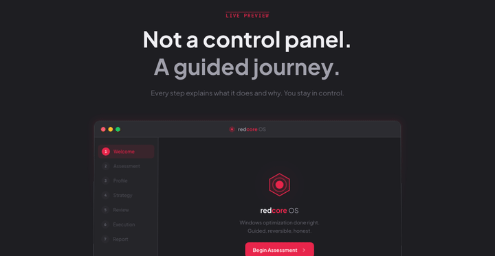

# redcore OS

  

  
  
  

  <a href="https://github.com/redpersongpt/redcoreOS/releases/latest" target="_blank" style="display:inline-flex;align-items:center;gap:0.5rem;background:#ff3b6d;color:#fff;font-weight:600;padding:0.85rem 1.6rem;border-radius:999px;box-shadow:0 15px 35px rgba(255,59,109,0.35);text-decoration:none;">
    Download redcore OS
  </a>

---

Windows optimization that actually works. Scans your PC, shows you what it'll change, you decide what runs.

250 actions across privacy, performance, gaming, network, shell, security, and power. Open source. Free.

**[redcoreos.net](https://redcoreos.net)** · **[Download](https://github.com/redpersongpt/redcoreOS/releases/latest)**

## What it does

- **Privacy** — kills telemetry, ads, Copilot, Recall, activity tracking, clipboard sync, location
- **Performance** — timer resolution fix, core parking, MMCSS tuning, memory compression, NDU leak fix
- **Gaming** — Game DVR kill, MPO disable, legacy flip, GPU telemetry block, HAGS control
- **Services** — disables 40+ unnecessary background services
- **Shell** — removes Start menu ads, restores classic right-click, hides widgets
- **Network** — Nagle disable, QoS fix, offloading control
- **Security** — VBS/HVCI control, Defender management, CPU mitigations (expert-only)
- **Power** — High Performance plan, fast startup fix, device power management

## How it works

1. Launch the app
2. It scans your hardware and software
3. You pick what to change — every question shows the exact registry keys
4. Review everything before it runs
5. Done

> **SmartScreen warning?** Normal for unsigned apps. Click "More info" → "Run anyway". Code signing costs $200-400/yr — source code is right here.

## See it in action

  

## Contributing

[CONTRIBUTING.md](CONTRIBUTING.md) · [SECURITY.md](SECURITY.md)

---

  <a href="https://redcoreos.net"><strong>redcoreos.net</strong></a>&nbsp;&nbsp;·&nbsp;&nbsp;<a href="https://github.com/redpersongpt/redcoreOS/releases/latest"><strong>Download</strong></a>&nbsp;&nbsp;·&nbsp;&nbsp;<strong>GPL-3.0</strong>

